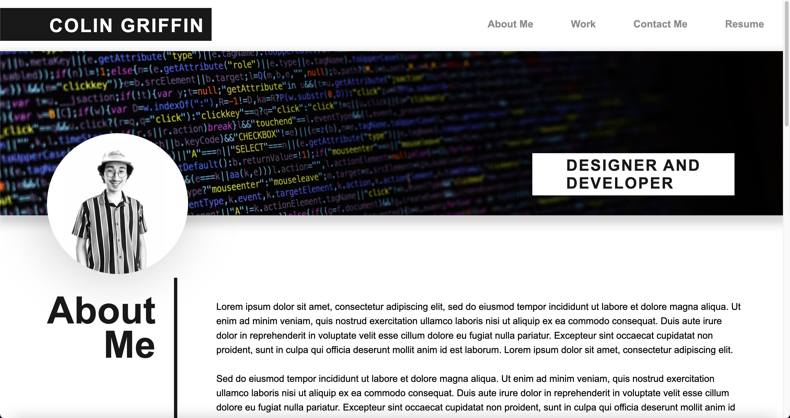

# Personal-Developer-Portfolio
Portfolio site to show off projects and skillset to potential employers.

I designed this portfolio to allow perspective employers to learn more about me as a developer, view my work, and contact me for inquires regarding employment.

The site was designed with simplicity in mind and ease of navigation for the user. All links were checked upon deployment to ensure proper functionality and interaction.

Deployed application URL:
https://griffindesign.github.io/Personal-Developer-Portfolio/

GitHub Repository URL:
https://github.com/GriffinDesign/Personal-Developer-Portfolio

Deployed application URL:
https://griffindesign.github.io/Personal-Developer-Portfolio/

GitHub Repository URL:
https://github.com/GriffinDesign/Personal-Developer-Portfolio
